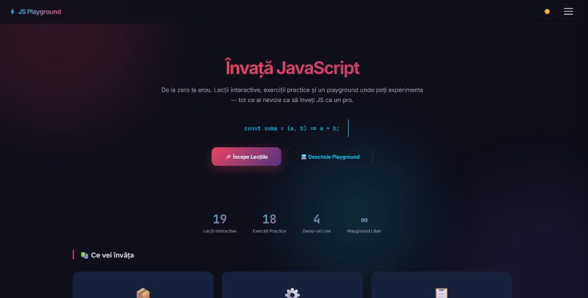
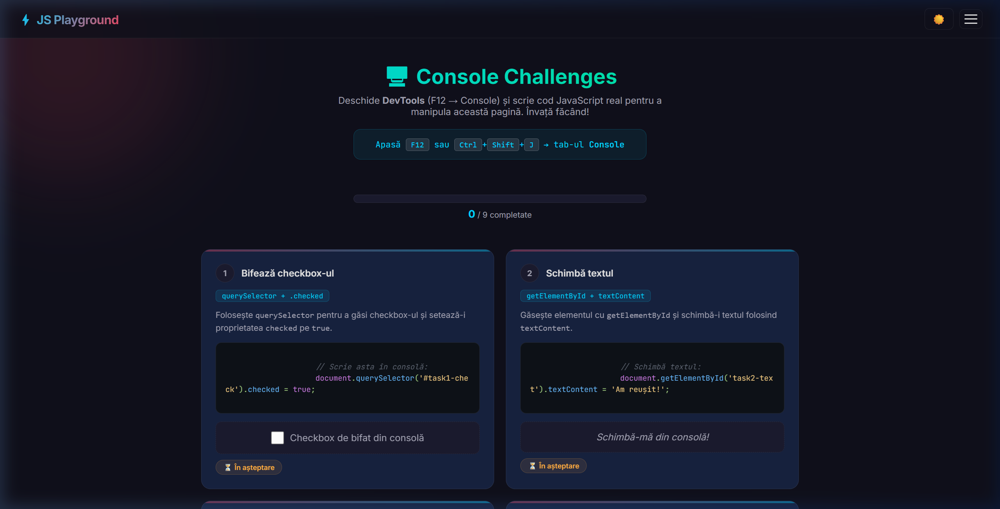
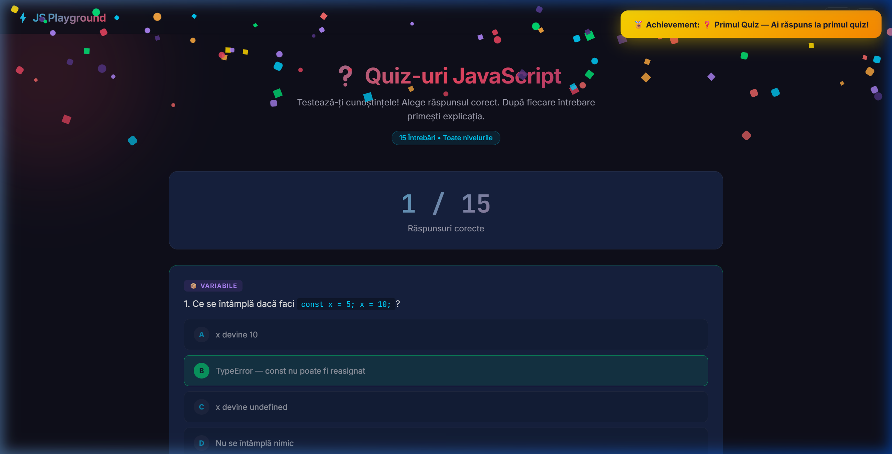
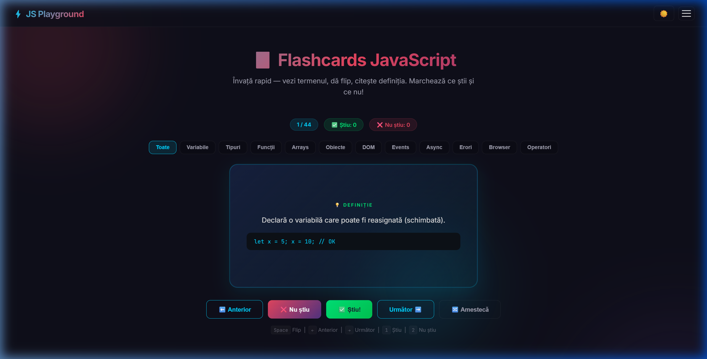
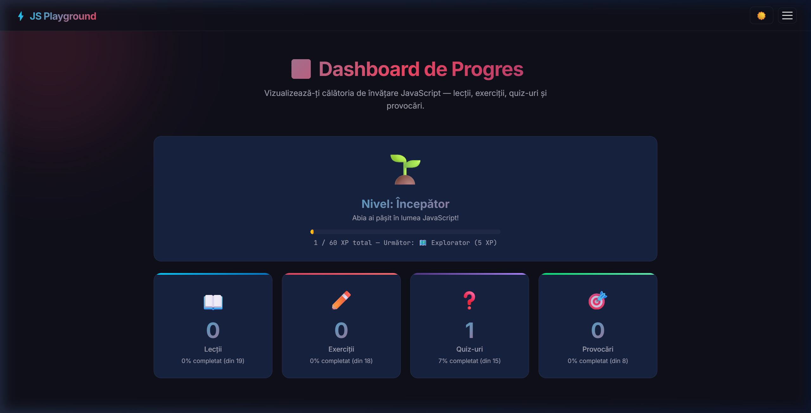
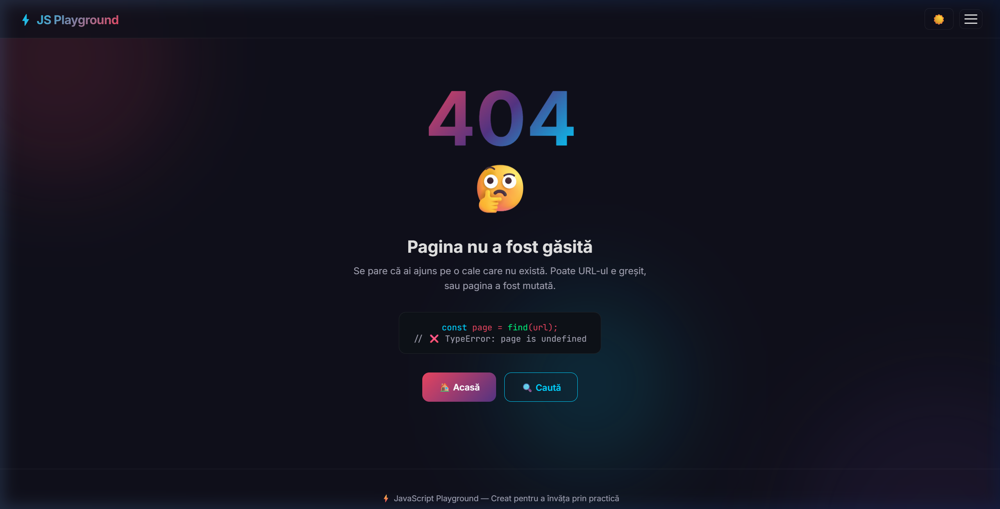

# ⚡ JavaScript Playground

> Platformă interactivă de învățare JavaScript — de la zero la erou! 🚀



---

## 🎯 Despre Proiect

**JavaScript Playground** este o platformă educațională completă pentru a învăța JavaScript de la zero. Include lecții interactive, exerciții practice, quiz-uri, provocări, mini-proiecte și multe altele — totul într-un singur loc, cu un design modern și profesional.

**Creat de [poprobert0412](https://github.com/poprobert0412)** 🧑‍💻

---

## 🌟 Funcționalități

| Funcționalitate | Descriere |
|---|---|
| 📖 **19 Lecții Interactive** | De la variabile la async/await, cu demo-uri live |
| ✏️ **18 Exerciții Practice** | Cu hint-uri, de la simplu la Boss Final |
| ❓ **15 Quiz-uri** | Testează-ți cunoștințele cu feedback instant |
| 🎯 **8 Provocări Consolă** | Scrie JavaScript direct din F12! |
| 🖥️ **9 Console Challenges** | Deschide DevTools → Console și manipulează pagina cu cod real! |
| 🚀 **3 Mini-Proiecte** | To-Do List, Quiz Game, Weather App |
| 💻 **Playground** | Consolă JS interactivă cu autocomplete |
| 🧩 **Code Puzzle** | Drag & drop — aranjează codul corect |
| 🎴 **Flashcards** | Memorare rapidă cu 44 termeni + flip 3D |
| 📊 **Dashboard Progres** | Vizualizează-ți progresul cu grafice |
| 🏆 **10 Achievements** | Colecționează badge-uri pe parcurs! |
| 📋 **Cheatsheet** | Toate conceptele pe o pagină |
| 🔧 **Tutorial DevTools** | Învață să folosești consola Chrome |
| 🐛 **Tutorial Debugging** | Tehnici de depanare profesionale |
| 📖 **Glosar 238+ Termeni** | Dicționar complet JavaScript |
| 🔍 **Căutare Instant** | Găsește orice concept rapid |
| 📝 **Dark/Light Mode** | Tema preferată salvată în localStorage |
| ⏱️ **Timer pe Puzzle** | 60 secunde cu bonus de timp la scor |
| 🎊 **Confetti Animation** | Ploaie de confetti la răspuns corect |
| 🔊 **Sound Effects** | Ding melodic la corect, buzz la greșit |
| ⌨️ **Ctrl+K Căutare** | Scurtătură globală pentru căutare |
| 📥 **Export/Import** | Salvează/restaurează progresul ca JSON |
| ✨ **Page Transitions** | Slide-up smooth la încărcare cu loading bar gradient |
| 📜 **Scroll Animations** | 5 variante direcționale (fade-up/down/left/right, scale-up) cu blur |
| 💬 **Tooltip-uri** | Hover arată descrieri pe link-uri |
| 🤔 **Pagina 404** | Pagină custom cu cod animat |
| 📱 **Responsive Design** | Perfect pe telefon, tabletă și desktop |

---

## 🛠️ Tehnologii

- **HTML5** — Structură semantică
- **CSS3** — Design modern cu variabile CSS, gradienți, animații, glassmorphism
- **JavaScript (Vanilla)** — Zero dependențe externe, cod curat și comentat
- **Google Fonts** — Inter + JetBrains Mono
- **localStorage** — Salvare progres, teme, achievements
- **Intersection Observer** — Scroll animations cu 5 variante direcționale
- **MutationObserver** — Detectare automată completare Console Challenges
- **Web Audio API** — Sound effects fără fișiere externe
- **Responsive Design** — 3 breakpoints (1024px, 768px, 480px)

---

## 📁 Structura Proiectului

```
📦 JavaScript-Playground/
├── 📄 index.html                # Pagina principală (landing page)
├── 📄 lectii.html               # 19 lecții interactive
├── 📄 exercitii.html            # 18 exerciții practice
├── 📄 quizuri.html              # 15 quiz-uri
├── 📄 provocari.html            # 8 provocări consolă
├── 📄 proiecte.html             # 3 mini-proiecte
├── 📄 playground.html           # Consolă JS interactivă
├── 📄 puzzle.html               # 10 code puzzle-uri
├── 📄 flashcards.html           # 44 flashcards JavaScript
├── 📄 console-challenges.html   # 🆕 9 Console Challenges (DevTools)
├── 📄 achievements.html         # Pagina achievements
├── 📄 dashboard.html            # Dashboard progres
├── 📄 cheatsheet.html           # Referință rapidă
├── 📄 devtools.html             # Tutorial DevTools
├── 📄 debugging.html            # Tutorial debugging
├── 📄 glosar.html               # Glosar 238+ termeni
├── 📄 search.html               # Căutare instant
├── 📄 404.html                  # Pagină 404 custom
├── 📂 css/
│   └── 📄 styles.css            # Stiluri CSS partajate
├── 📂 js/
│   ├── 📄 script.js             # JS principal (partajat, 16 secțiuni)
│   ├── 📄 index.js              # Typing animation (landing)
│   ├── 📄 glosar.js             # Logica glosar
│   ├── 📄 quizuri.js            # Logica quiz + confetti + sounds
│   ├── 📄 proiecte.js           # Logica mini-proiecte
│   ├── 📄 provocari.js          # Logica provocări
│   ├── 📄 search.js             # Logica căutare
│   ├── 📄 achievements.js       # Logica achievements
│   ├── 📄 dashboard.js          # Logica dashboard
│   ├── 📄 puzzle.js             # Logica code puzzle + confetti
│   ├── 📄 flashcards.js         # Logica flashcards
│   └── 📄 console-challenges.js # 🆕 Console Challenges detection
├── 📄 LICENSE                   # Licență MIT
├── 📄 README.md                 # Acest fișier
└── 🖼️ screenshot.png            # Preview homepage
```

---

## 🚀 Cum Rulezi Local

1. **Clonează repository-ul:**
   ```bash
   git clone https://github.com/poprobert0412/Typescript.git
   cd Typescript
   ```

2. **Pornește un server local:**
   ```bash
   npx -y serve . -l 3456
   ```

3. **Deschide în browser:**
   ```
   http://localhost:3456
   ```

> 💡 Alternativ, poți deschide `index.html` direct într-un browser (clic dublu).

---

## 📸 Screenshots

### 🏠 Homepage


### 🖥️ Console Challenges — Învață din DevTools


### ❓ Quiz cu Confetti + Achievement Toast


### 🃏 Flashcards cu Flip 3D


### 📊 Dashboard Progres


### 🤔 Pagina 404 Custom


---

## 🖥️ Console Challenges — Cum Funcționează?

Aceasta este una dintre cele mai **unice** funcționalități ale platformei:

1. Deschizi pagina `Console Challenges` 
2. Apeși **F12** → tab-ul **Console**
3. Scrii comenzi JavaScript reale pentru a manipula pagina
4. Pagina **detectează automat** ce ai făcut (MutationObserver + polling)
5. La **3 completări** → confetti! La **9** → achievement special!

**Concepte acoperite:**
`querySelector`, `getElementById`, `textContent`, `classList.add`, `style`, `addEventListener`, `createElement`, `appendChild`, `setAttribute`, `innerHTML`, `remove()`

---

## 👤 Autor

**poprobert0412**

- 🐙 GitHub: [github.com/poprobert0412](https://github.com/poprobert0412)
- 💼 LinkedIn: [linkedin.com/in/poprobert1999](https://www.linkedin.com/in/poprobert1999)

---

## 📄 Licență

Acest proiect este licențiat sub [MIT License](LICENSE).

**© 2026 poprobert0412. Toate drepturile rezervate.**

> ⚠️ **IMPORTANT:** Acest proiect a fost creat și conceptualizat de **poprobert0412**.
> Ideea originală și implementarea aparțin autorului. Oricine poate descărca și folosi
> proiectul, dar trebuie să includă credit către autorul original.
> **Nu este permisă revendicarea proiectului ca fiind propriu.**

---

⚡ *Creat cu pasiune pentru a învăța JavaScript prin practică!*
